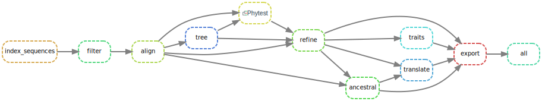

# Nextstrain + Phytest

This repository provides an example of using [phytest]() for quality control in a Snakemake pipeline. Phytest allows us to write tests for our pipeline the same way we write test for our code. This repo builds on the data and scripts associated with the [Zika virus tutorial](https://nextstrain.org/docs/getting-started/zika-tutorial). We add phytest to the pipeline to ensure our alignment and maximum likelihood tree meet our explicit requirements before proceeding though the pipeline.



For more information see the [phytest]() docs.

## Testing

We have added the following rule to the Snakemake workflow. We use phytest to run our tests on the alignment and the tree, outputting a HTML report. Only if all our tests past will we continue through the pipeline. 

```yml
rule phytest:
    message: "Running phytest"
    input:
        alignment = rules.align.output.alignment,
        tree = rules.tree.output.tree,
        phytest = phytest_file
    output:
        report = "results/phytest-report.html"
    shell:
        """
        phytest {input.phytest} -a {input.alignment} -t {input.tree} --report
        mv report.html {output.report}
        """
```

In the `config/test.py` file we define our tests that the alignment and tree must pass. 

```python
from phytest import Alignment, Sequence, Tree

def test_alignment_size(alignment: Alignment):
    """
    By testing the size of our alignment we can 
    ensure that our pipeline won't run if there are 
    accidental sequence additions or deletions.
    """
    alignment.assert_length(34)
    alignment.assert_width(10769)

def test_sequence_no_gaps(sequence: Sequence):
    """
    We know that our sequences shouldn't have any
    gaps so we enforce this constrain to ensure the 
    quality of our alignment.
    """
    sequence.assert_count_gaps(0)

def test_tree_is_SG_monophyletic(tree: Tree):
    """
    We expect that all the samples from Singapore will 
    form a monophyletic clade in the tree.
    """
    singapore_tips = [tip for tip in tree.get_terminals() if 'SG_' in tip.name]
    tree.assert_is_monophyletic(singapore_tips)

```


## Usage 

Create a conda environment named `nextstrain` and install all the necessary software using mamba:

```bash
mamba create -n nextstrain \
  -c conda-forge -c bioconda \
  nextstrain-cli augur auspice nextalign snakemake git \
  --yes
```

Activate the conda environment:

```bash
conda activate nextstrain
```

Add the `phytest` dependency.

```bash
pip install phytest
```

Run the pipeline 

```
snakemake -c 1 
```
